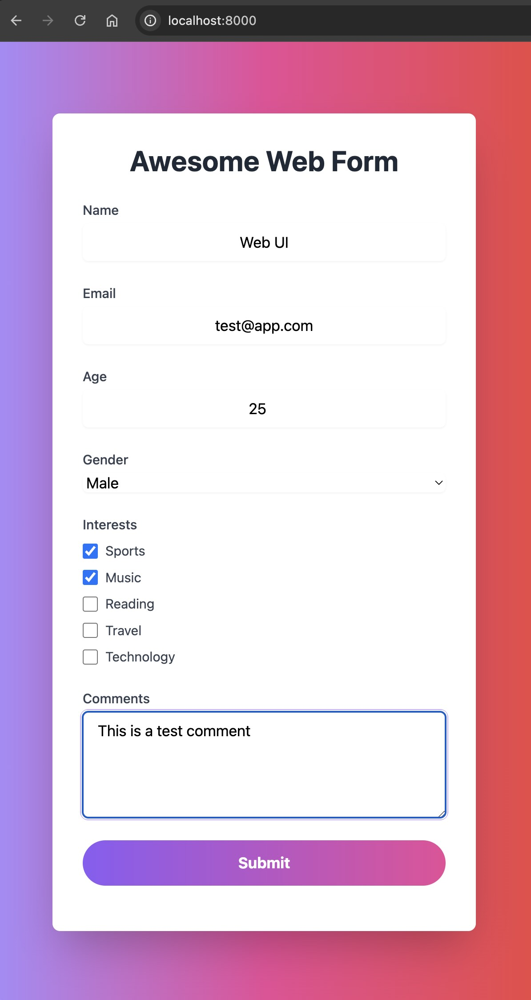

## Golang WASM And Web UI Form

> Documentation Below Screenshot



> Please See The Contents Of >
- `main.go` (Front End)
- `server.go` (Backend Server)
- `index.html` (Web Form)

```bash
go get -u github.com/maxence-charriere/go-app/v10/pkg/app
```

> Current Working Directory >

```bash
~/git/goworkspace/src/wasm_v1
```

```bash
cat $GOROOT/misc/wasm/wasm_exec.js > ~/git/goworkspace/src/wasm_v1/web/wasm_exec.js
```

```bash
go mod init && go mod tidy
```

> Run The Server `server.go`

```bash
go build -o server server.go
```

```bash
./server
Server is running on :8080
```

```bash
 ls -l
total 13936
-rw-r--r--  1 user1  staff      382 Oct 17 09:59 README.md
-rw-r--r--@ 1 user1  staff      186 Oct 17 08:31 go.mod
-rw-r--r--@ 1 user1  staff     1448 Oct 17 08:29 go.sum
-rw-r--r--  1 user1  staff     7442 Oct 17 09:54 main.go
-rwxr-xr-x@ 1 user1  staff  7107634 Oct 17 08:58 server --------> Binary
-rw-r--r--  1 user1  staff     1871 Oct 17 08:58 server.go
drwxr-xr-x  5 user1  staff      160 Oct 17 09:54 web -----------> Directory
```

```bash
ls -l web
total 33776
-rwxr-xr-x@ 1 user1  staff  17265271 Oct 17 09:54 app.wasm -----> Generated
-rw-r--r--  1 user1  staff      1091 Oct 17 09:48 index.html
-rw-r--r--  1 user1  staff     16687 Oct 17 08:30 wasm_exec.js
```

> Build Front-End UI `main.go`

```bash
GOARCH=wasm GOOS=js go build -o web/app.wasm main.go
```

```bash
go run main.go
Server running on http://localhost:8000
```

> Access The Web UI

```
http://localhost:8000/
```